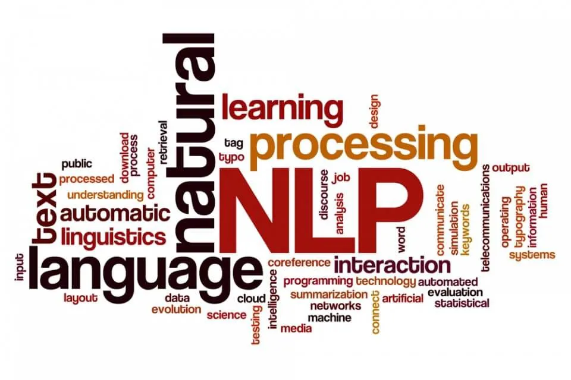

# Sentiment Analysis of Persian Sentences Using NLP
Project Description: This project focuses on developing and evaluating a sentiment analysis model for Persian-language sentences, leveraging natural language processing (NLP) techniques. The primary objective is to preprocess user comments from two prominent Persian datasets—Digikala and Snapp—utilizing the FastText and Hazm libraries. These processed datasets are then employed to train and evaluate multiple neural network architectures, as well as traditional machine learning models.

Key tasks include training and comparing the performance of various neural networks, such as Long Short-Term Memory (LSTM), Recurrent Neural Networks (RNN), Convolutional Neural Networks (CNN), and dense (fully connected) networks. Additionally, classic machine learning algorithms such as Linear Regression, Gaussian Naive Bayes (GNB), Naive Bayes (NB), and Random Forest are trained to compare their results against the deep learning models.

A fine-tuned version of the BERT model is also implemented and tested for improved performance on this task. All models and algorithms are tested both offline and in real-time, using popular machine learning frameworks TensorFlow and PyTorch.

This project offers an in-depth comparison of both traditional machine learning methods and advanced neural network techniques in the context of Persian sentiment analysis, providing valuable insights into their respective accuracies and efficiencies.
Project Description: This project focuses on developing and evaluating a sentiment analysis model for Persian-language sentences, leveraging natural language processing (NLP) techniques. The primary objective is to preprocess user comments from two prominent Persian datasets—Digikala and Snapp—utilizing the FastText and Hazm libraries. These processed datasets are then employed to train and evaluate multiple neural network architectures, as well as traditional machine learning models. Key tasks include training and comparing the performance of various neural networks, such as Long Short-Term Memory (LSTM), Recurrent Neural Networks (RNN), Convolutional Neural Networks (CNN), and dense (fully connected) networks. Additionally, classic machine learning algorithms such as Linear Regression, Gaussian Naive Bayes (GNB), Naive Bayes (NB), and Random Forest are trained to compare their results against the deep learning models. A fine-tuned version of the BERT model is also implemented and tested for improved performance on this task. All models and algorithms are tested both offline and in real-time, using popular machine learning frameworks TensorFlow and PyTorch. This project offers an in-depth comparison of both traditional machine learning methods and advanced neural network techniques in the context of Persian sentiment analysis, providing valuable insights into their respective accuracies and efficiencies.

